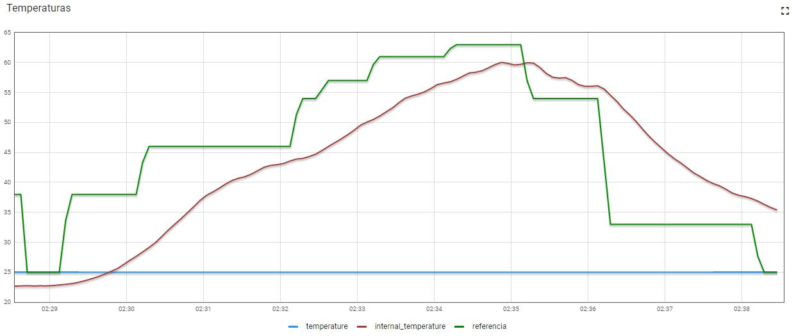
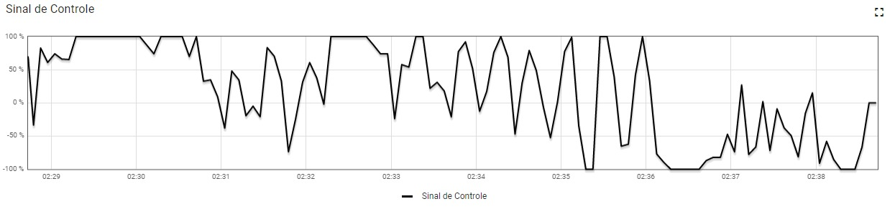
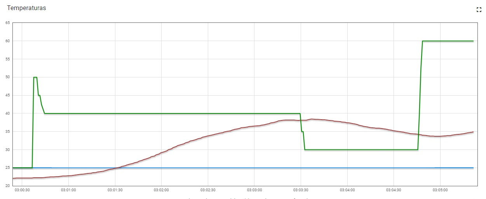
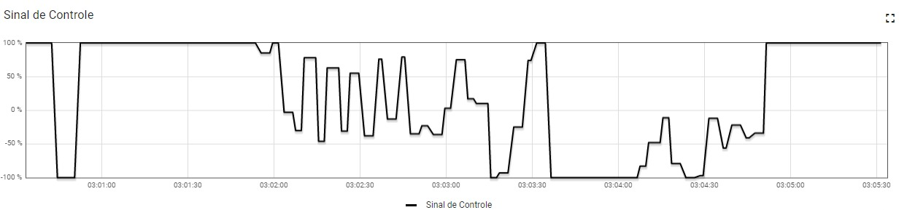

# Fundamentos de Sistemas Embarcados - Projeto 2 - 2022/2 - Controlador Forno para soldagem

## Descrição do projeto
Implementação de um sistema (que simula) o controle de um forno para soldagem de placas de circuito impresso (PCBs).

Para acesso a mais informações [clique aqui](https://gitlab.com/fse_fga/trabalhos-2022_2/trabalho-2-2022-2).

## Como Rodar
Este projeto foi desenvolvido para ser executado em um ambiente Linux de uma Raspberry Pi.

Passos para execução:
```
1. Clonar este projeto dentro de uma Raspberry Pi que possua os componentes necessários;
2. Dentro do repositório clonado, basta rodar:

$ make all

3. Este comando irá gerar um arquivo executável, que pode ser facilmente executado passando seu caminho no terminal:

$ ./bin/bin
```

## Relatório dos experimentos
Para exemplificar os resultados alcançados, foram feitos dois experimentos envolvendo o controle da temperatura do forno, no primeiro experimento,
a temperatura foi controlada pela curva reflow que pode ser acessada em [curvaReflow.csv](assets/curva_Reflow.csv) Já no segundo experimento, a temperatura
foi controlada pela temperatura de referência da dashboard.

### Experimento 1 - Temperatura baseada na curva de referência 

<center>



Figura 1 - Experimento 1 (temperaturas)




Figura 2 - Experimento 1 (sensor de controle)

</center>

### Experimento 2 - Temperatura controlada pela dashboard

<center>



Figura 3 - Experimento 2 (temperaturas)




Figura 4 - Experimento 2 (sensor de controle)

</center>


## Apresentação

[Link do vídeo no youtube](https://youtu.be/RmUOTldNUoE).
